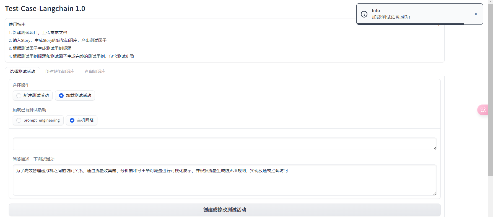
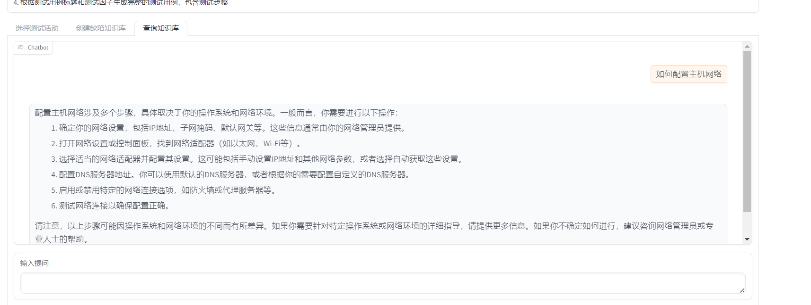

# test_case_langchain
大模型协助生成测试用例

一、需求价值

测试设计过程中，需要测试人员对测试软件系统深入了解，提前推测出缺陷预防，从而补充用例，这很依赖测试人员的个人能力，所以希望借助大模型根据输入文档推测出缺陷知识库，帮助测试人员补充测试场景和测试用例

二、业务流程

*   基于RAG技术，根据输入的Story需求、测试方案搭建向量数据库
*   根据输入的需求，引导大模型产出缺陷知识库，产出测试因子
*   根据测试因子生成测试用例标题，并根据用例规范修正测试用例标题，清晰说明测试检测点和期望结果，并最终根据测试标题和测试因子生成测试步骤作为一条完整的测试用例

三、流程介绍

（一）新建测试活动

选择新建测试活动，输入测试活动名和测试活动介绍

（二）加载测试活动

选择之前新建的测试活动

（三）创建向量数据库

上传文档`设计文档、测试方案`等后，会对文本进行分片和token化处理，最终嵌入到向量数据库中，后续可以通过查询知识库查询文档内容

（四）生成检查点

根据特定格式输入需求名后，点击生成，会自动生成检查点

TODO：
1. RetrievalChain会查询知识库后会先总结问题`question_generator`再查询一遍，设置system_prompt返回json格式失败，后续本地搭建模型微调试试

（五）查询知识库

